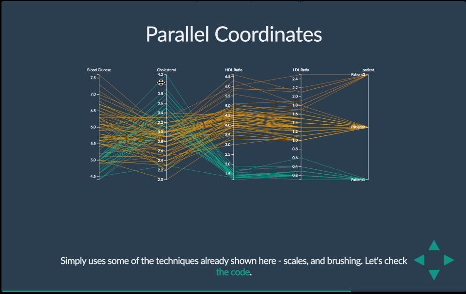
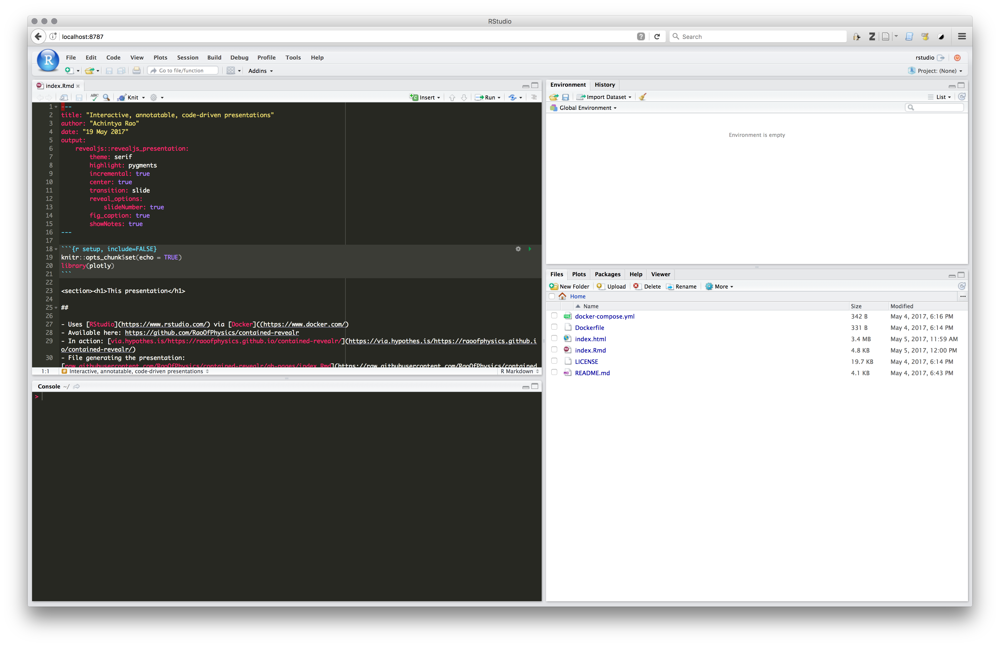

<script src="https://hypothes.is/embed.js" async></script>
```{r setup, include=FALSE}
knitr::opts_chunk$set(echo = TRUE)
library(plotly)
library(tufte)
# invalidate cache when the tufte version changes
knitr::opts_chunk$set(tidy = FALSE, cache.extra = packageVersion('tufte'))
options(htmltools.dir.version = FALSE)
```

# The inspiration!



- [Creating Visualizations with D3](http://antarctic-design.co.uk/biovis-workshop15/) by [Eamonn Maguire](https://github.com/eamonnmag)

# Using R code in your presentation

## Example of some code

```{r cars}
summary(mtcars)
```

## Inline code

So, `sqrt(81)*4*pi` becomes `r sqrt(81)*4*pi`.

## Import some data

```{r}
I_jean <- read.delim("http://bit.ly/avml_ggplot2_data")
head(I_jean)
```

- Source: [https://jofrhwld.github.io/avml2012/](https://jofrhwld.github.io/avml2012/)

## Static plots

```{r, echo=FALSE}

p <- ggplot(mtcars, aes(x = factor(1), fill = factor(cyl))) + 
  geom_bar(width = 0.8, position = "dodge", colour = "black")

p
```

## Interactive plots!

```{r, echo=FALSE, warning=FALSE}
ggplotly(p)
```

## Make more plots!

```{r, echo=FALSE, warning=FALSE}

# Code from https://jofrhwld.github.io/avml2012/
# Taken as an example only under fair-use practice
# All rights reserved by the original author

p <- ggplot(I_jean, aes(x = Dur_msec, y = F1.n)) + 
  geom_point() + 
  stat_smooth(method="loess") +
  scale_x_log10(breaks = c(50, 100,200,300,400)) +
  scale_y_reverse() +
  ylab("Normalized F1") +
  xlab("Vowel duration (msec)") +
  theme_bw() +
  labs(title = "394 tokens of 'I' from one speaker")

ggplotly(p)
```

# Making a [reveal.js](http://lab.hakim.se/reveal-js/) presentation

## [R Markdown](http://rmarkdown.rstudio.com/) with embedded [R](https://www.r-project.org/) code

- [Source](https://raw.githubusercontent.com/RaoOfPhysics/contained-revealr/gh-pages/index.Rmd)
- Hosted on GitHub: [RaoOfPhysics/contained-revealr](https://github.com/RaoOfPhysics/contained-revealr)
- Displayed using [GitHub Pages](https://pages.github.com/): [raoofphysics.github.io/contained-revealr](https://raoofphysics.github.io/contained-revealr)
- Annotatable using [Hypothesis](https://hypothes.is):
    - Add `<script src="https://hypothes.is/embed.js" async></script>`

## The source file itself

- Create a new `R Markdown` file named `index.Rmd`
    - Select reveal.js from templates
- Add [YAML](http://www.yaml.org/) frontmatter!
- Instructions for reveal.js presentations: [rmarkdown.rstudio.com/revealjs_presentation_format.html](http://rmarkdown.rstudio.com/revealjs_presentation_format.html)
- Create sections and add content+code
- Knit your presentation!

# "But I hate / don't use R…"

## Other "engines" for code chunks

| Language | In RMarkdown | Plotly available |
|-----:|:-----:|:-----:|
| Python      | [Yes](http://rmarkdown.rstudio.com/authoring_knitr_engines.html#python) | [Yes](https://plot.ly/python/getting-started/) |
| JavaScript | [Yes](http://rmarkdown.rstudio.com/authoring_knitr_engines.html#javascript) | [Yes](https://plot.ly/javascript/getting-started/) |
| SQL | [Yes](http://rmarkdown.rstudio.com/authoring_knitr_engines.html#sql) | No |
| Bash | [Yes](http://rmarkdown.rstudio.com/authoring_knitr_engines.html#bash) | No |

More: http://rmarkdown.rstudio.com/authoring_knitr_engines.html

# "But I don't want to install R and its packages…"

## [RStudio](https://www.rstudio.com/) via [Docker](https://www.docker.com/)



## Using RStudio in your browser

- **Caveat!** Non-R engines don't work out of the box
- Create a directory for your project
- Add this [`Dockerfile`](https://github.com/RaoOfPhysics/contained-revealr/blob/master/Dockerfile) and this [`docker-compose.yml`](https://github.com/RaoOfPhysics/contained-revealr/blob/master/docker-compose.yml) to the directory
- Run `$ docker-compose up -d`
- Open RStudio in your browser at `localhost:8787` or `0.0.0.0:8787`
- Log in with "`rstudio`" as both the username and password
- To shutdown: `$ docker-compose down`

# Questions?